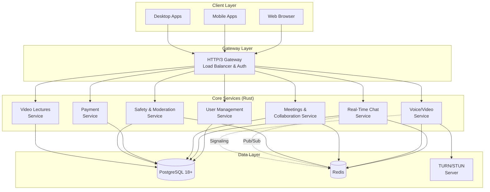

# Design Document

## Overview

LinkWithMentor is designed as a high-performance, scalable mentorship platform using a microservices architecture. The system leverages Rust for core services, PostgreSQL 18+ for data persistence, Redis for caching and real-time messaging, and HTTP/3 (QUIC) for optimal network performance. The platform supports multiple client types (web, mobile, desktop) and provides real-time collaboration tools with integrated payment processing and safety features.

## Architecture

### High-Level Architecture



### Service Communication

- **External Communication**: HTTP/3 (QUIC) for reduced latency and improved connection migration
- **Internal Communication**: HTTP/3 between services with Redis Pub/Sub for real-time events
- **Database Access**: TLS-encrypted connections with connection pooling
- **Real-time Features**: WebSockets over HTTP/3 for chat and WebRTC signaling

## Components and Interfaces

### 1. HTTP/3 Gateway Service

**Technology**: Envoy Proxy or NGINX with QUIC support
**Responsibilities**:
- Terminate HTTP/3 connections
- Load balancing across service instances
- JWT token validation
- Rate limiting and DDoS protection
- Request routing to appropriate microservices

**Key Interfaces**:
```rust
// Gateway configuration for service routing
struct ServiceRoute {
    path_prefix: String,
    service_name: String,
    load_balancer: LoadBalancerType,
    auth_required: bool,
}
```

### 2. User Management Service

**Technology**: Rust (Axum framework)
**Responsibilities**:
- User registration and authentication
- Dual-role profile management (users can be both mentor and mentee)
- Dynamic role-based access control (RBAC)
- JWT token issuance and validation with role context
- OAuth integration (Google, etc.)
- Role switching and context management

**Key Interfaces**:
```rust
#[derive(Serialize, Deserialize)]
struct User {
    user_id: Uuid,
    username: String,
    email: String,
    roles: Vec<UserRole>, // Changed to support multiple roles
    hashed_password: String,
    payment_methods: Vec<PaymentMethod>,
    created_at: DateTime<Utc>,
    updated_at: DateTime<Utc>,
}

#[derive(Serialize, Deserialize)]
struct PaymentMethod {
    payment_method_id: Uuid,
    label: String, // e.g., "Primary UPI", "PayPal Business", "Secondary UPI"
    provider: PaymentProvider,
    vpa_address: String, // UPI VPA, PayPal email, etc.
    is_primary: bool,
    is_active: bool,
    created_at: DateTime<Utc>,
}

#[derive(Serialize, Deserialize)]
enum PaymentProvider {
    UPI,
    PayPal,
    GooglePay,
    Stripe,
    Razorpay,
}

#[derive(Serialize, Deserialize)]
enum UserRole {
    Mentee,
    Mentor,
    Admin,
}

#[derive(Serialize, Deserialize)]
struct Profile {
    user_id: Uuid,
    bio: String,
    mentor_profile: Option<MentorProfile>,
    mentee_profile: Option<MenteeProfile>,
    payment_preferences: serde_json::Value,
}

#[derive(Serialize, Deserialize)]
struct MentorProfile {
    specializations: serde_json::Value, // JSONB - areas they can teach
    hourly_rate: Decimal,
    availability: serde_json::Value,
    rating: Decimal,
    total_sessions_as_mentor: i32,
    years_of_experience: Option<i32>,
    certifications: Vec<String>,
    is_accepting_mentees: bool,
}

#[derive(Serialize, Deserialize)]
struct MenteeProfile {
    learning_goals: serde_json::Value, // JSONB - areas they want to learn
    interests: Vec<String>,
    experience_level: ExperienceLevel,
    total_sessions_as_mentee: i32,
    preferred_session_types: Vec<SessionType>,
}

// REST API endpoints
POST /api/v1/auth/register
POST /api/v1/auth/login
GET /api/v1/users/{user_id}
PUT /api/v1/profiles/{user_id}
POST /api/v1/users/{user_id}/roles/mentor    // Enable mentor role
POST /api/v1/users/{user_id}/roles/mentee    // Enable mentee role
DELETE /api/v1/users/{user_id}/roles/{role}  // Disable specific role
GET /api/v1/users/{user_id}/mentor-profile   // Get mentor-specific profile
PUT /api/v1/users/{user_id}/mentor-profile   // Update mentor profile
GET /api/v1/users/{user_id}/mentee-profile   // Get mentee-specific profile
PUT /api/v1/users/{user_id}/mentee-profile   // Update mentee profile

// Payment method management endpoints
GET /api/v1/users/{user_id}/payment-methods     // Get all payment methods
POST /api/v1/users/{user_id}/payment-methods    // Add new payment method
PUT /api/v1/users/{user_id}/payment-methods/{payment_method_id}  // Update payment method
DELETE /api/v1/users/{user_id}/payment-methods/{payment_method_id}  // Remove payment method
POST /api/v1/users/{user_id}/payment-methods/{payment_method_id}/set-primary  // Set as primary
```

### 3. Real-Time Chat Service

**Technology**: Rust (Axum) + WebSockets + Redis Pub/Sub
**Responsibilities**:
- 1:1 and group messaging
- Message persistence and history
- Real-time message delivery
- Integration with Safety & Moderation service

**Key Interfaces**:
```rust
#[derive(Serialize, Deserialize)]
struct ChatMessage {
    message_id: Uuid,
    session_id: Option<Uuid>,
    sender_id: Uuid,
    recipient_id: Option<Uuid>, // For 1:1 chats
    group_id: Option<Uuid>,     // For group chats
    content: String,
    message_type: MessageType,
    timestamp: DateTime<Utc>,
    moderation_status: ModerationStatus,
}

// WebSocket message types
enum WSMessage {
    SendMessage(ChatMessage),
    MessageReceived(ChatMessage),
    TypingIndicator { user_id: Uuid, is_typing: bool },
    UserJoined { user_id: Uuid },
    UserLeft { user_id: Uuid },
}
```

### 4. Voice/Video Service

**Technology**: Rust + WebRTC + TURN/STUN Server (Coturn)
**Responsibilities**:
- WebRTC signaling server
- Session management for voice/video calls
- Screen sharing coordination
- Media relay coordination with TURN server

**Key Interfaces**:
```rust
#[derive(Serialize, Deserialize)]
struct CallSession {
    session_id: Uuid,
    participants: Vec<Uuid>,
    call_type: CallType, // Audio, Video, ScreenShare
    status: CallStatus,
    started_at: DateTime<Utc>,
    ended_at: Option<DateTime<Utc>>,
}

// WebRTC signaling messages
enum SignalingMessage {
    Offer { sdp: String, session_id: Uuid },
    Answer { sdp: String, session_id: Uuid },
    IceCandidate { candidate: String, session_id: Uuid },
    CallEnd { session_id: Uuid },
}
```

### 5. Meetings & Collaboration Service

**Technology**: Rust (Axum)
**Responsibilities**:
- Session scheduling and calendar integration
- Whiteboard and collaborative tools state management
- Session notes and materials storage
- Recurring session management

**Key Interfaces**:
```rust
#[derive(Serialize, Deserialize)]
struct MentorshipSession {
    session_id: Uuid,
    mentor_id: Uuid,
    mentee_id: Uuid,
    title: String,
    description: Option<String>,
    scheduled_start: DateTime<Utc>,
    scheduled_end: DateTime<Utc>,
    actual_start: Option<DateTime<Utc>>,
    actual_end: Option<DateTime<Utc>>,
    status: SessionStatus,
    session_type: SessionType, // OneTime, Recurring
    whiteboard_data: Option<serde_json::Value>,
    notes: Option<String>,
}

// REST API endpoints
POST /api/v1/sessions
GET /api/v1/sessions/{session_id}
PUT /api/v1/sessions/{session_id}/whiteboard
```

### 6. Payment Service

**Technology**: Rust (Axum) + Google Pay Business UPI
**Responsibilities**:
- Payment processing for all monetization models
- Escrow management for session-based payments
- Mentor payout processing
- Transaction ledger maintenance

**Key Interfaces**:
```rust
#[derive(Serialize, Deserialize)]
struct Transaction {
    tx_id: Uuid,
    source_user_id: Uuid,
    target_user_id: Uuid,
    source_payment_method_id: Option<Uuid>,
    target_payment_method_id: Option<Uuid>,
    session_id: Option<Uuid>,
    amount: Decimal,
    currency: String,
    transaction_type: TransactionType,
    status: TransactionStatus,
    gateway_ref: String,
    service_fee: Decimal,
    created_at: DateTime<Utc>,
    completed_at: Option<DateTime<Utc>>,
}

#[derive(Serialize, Deserialize)]
struct Subscription {
    subscription_id: Uuid,
    mentee_id: Uuid,
    mentor_id: Uuid,
    plan_type: SubscriptionPlan,
    start_date: DateTime<Utc>,
    end_date: DateTime<Utc>,
    auto_renew: bool,
    status: SubscriptionStatus,
}
```

### 7. Safety & Moderation Service

**Technology**: Rust (high-performance requirement)
**Responsibilities**:
- Real-time content analysis
- Automated policy enforcement
- Abuse reporting and investigation
- User behavior monitoring

**Key Interfaces**:
```rust
#[derive(Serialize, Deserialize)]
struct ModerationEvent {
    event_id: Uuid,
    content_id: String,
    content_type: ContentType, // Text, Image, Video, Audio
    user_id: Uuid,
    severity: SeverityLevel,
    policy_violated: Vec<PolicyType>,
    action_taken: ModerationAction,
    timestamp: DateTime<Utc>,
}

// Real-time moderation API
POST /api/v1/moderation/analyze
POST /api/v1/moderation/report
GET /api/v1/moderation/events/{user_id}
```

## Data Models

### PostgreSQL Schema Design

```sql
-- Users and Authentication
CREATE TABLE users (
    user_id UUID PRIMARY KEY DEFAULT gen_random_uuid(),
    username VARCHAR(50) UNIQUE NOT NULL,
    email VARCHAR(255) UNIQUE NOT NULL,
    roles TEXT[] NOT NULL DEFAULT '{}', -- Array of roles: mentor, mentee, admin
    hashed_password VARCHAR(255) NOT NULL,
    email_verified BOOLEAN DEFAULT FALSE,
    created_at TIMESTAMP WITH TIME ZONE DEFAULT NOW(),
    updated_at TIMESTAMP WITH TIME ZONE DEFAULT NOW()
);

-- Payment Methods for Users
CREATE TABLE payment_methods (
    payment_method_id UUID PRIMARY KEY DEFAULT gen_random_uuid(),
    user_id UUID NOT NULL REFERENCES users(user_id) ON DELETE CASCADE,
    label VARCHAR(100) NOT NULL, -- e.g., "Primary UPI", "PayPal Business"
    provider VARCHAR(20) NOT NULL, -- UPI, PayPal, GooglePay, Stripe, etc.
    vpa_address VARCHAR(255) NOT NULL, -- UPI VPA, PayPal email, etc.
    is_primary BOOLEAN DEFAULT FALSE,
    is_active BOOLEAN DEFAULT TRUE,
    created_at TIMESTAMP WITH TIME ZONE DEFAULT NOW(),
    updated_at TIMESTAMP WITH TIME ZONE DEFAULT NOW(),
    
    -- Ensure only one primary payment method per user
    CONSTRAINT unique_primary_per_user EXCLUDE (user_id WITH =) WHERE (is_primary = true),
    -- Index for quick lookups
    INDEX idx_payment_methods_user (user_id, is_active),
    INDEX idx_payment_methods_primary (user_id, is_primary) WHERE (is_primary = true)
);

-- User Profiles
CREATE TABLE profiles (
    user_id UUID PRIMARY KEY REFERENCES users(user_id) ON DELETE CASCADE,
    bio TEXT,
    payment_preferences JSONB,
    updated_at TIMESTAMP WITH TIME ZONE DEFAULT NOW()
);

-- Mentor-specific profiles
CREATE TABLE mentor_profiles (
    user_id UUID PRIMARY KEY REFERENCES users(user_id) ON DELETE CASCADE,
    specializations JSONB NOT NULL, -- Areas they can teach
    hourly_rate DECIMAL(10,2) NOT NULL,
    availability JSONB,
    rating DECIMAL(3,2) DEFAULT 0.00,
    total_sessions_as_mentor INTEGER DEFAULT 0,
    years_of_experience INTEGER,
    certifications TEXT[],
    is_accepting_mentees BOOLEAN DEFAULT TRUE,
    created_at TIMESTAMP WITH TIME ZONE DEFAULT NOW(),
    updated_at TIMESTAMP WITH TIME ZONE DEFAULT NOW()
);

-- Mentee-specific profiles
CREATE TABLE mentee_profiles (
    user_id UUID PRIMARY KEY REFERENCES users(user_id) ON DELETE CASCADE,
    learning_goals JSONB, -- Areas they want to learn
    interests TEXT[],
    experience_level VARCHAR(20) DEFAULT 'beginner',
    total_sessions_as_mentee INTEGER DEFAULT 0,
    preferred_session_types TEXT[],
    created_at TIMESTAMP WITH TIME ZONE DEFAULT NOW(),
    updated_at TIMESTAMP WITH TIME ZONE DEFAULT NOW()
);

-- Mentorship Sessions
CREATE TABLE mentorship_sessions (
    session_id UUID PRIMARY KEY DEFAULT gen_random_uuid(),
    mentor_id UUID NOT NULL REFERENCES users(user_id),
    mentee_id UUID NOT NULL REFERENCES users(user_id),
    title VARCHAR(255) NOT NULL,
    description TEXT,
    scheduled_start TIMESTAMP WITH TIME ZONE NOT NULL,
    scheduled_end TIMESTAMP WITH TIME ZONE NOT NULL,
    actual_start TIMESTAMP WITH TIME ZONE,
    actual_end TIMESTAMP WITH TIME ZONE,
    status VARCHAR(20) DEFAULT 'scheduled',
    session_type VARCHAR(20) DEFAULT 'one_time',
    whiteboard_data JSONB,
    notes TEXT,
    created_at TIMESTAMP WITH TIME ZONE DEFAULT NOW()
);

-- Chat Messages
CREATE TABLE chat_messages (
    message_id UUID PRIMARY KEY DEFAULT gen_random_uuid(),
    session_id UUID REFERENCES mentorship_sessions(session_id),
    sender_id UUID NOT NULL REFERENCES users(user_id),
    recipient_id UUID REFERENCES users(user_id),
    group_id UUID,
    content TEXT NOT NULL,
    message_type VARCHAR(20) DEFAULT 'text',
    moderation_status VARCHAR(20) DEFAULT 'approved',
    timestamp TIMESTAMP WITH TIME ZONE DEFAULT NOW(),
    
    -- Optimize for chat history queries
    INDEX idx_chat_session (session_id, timestamp),
    INDEX idx_chat_users (sender_id, recipient_id, timestamp)
);

-- Transactions and Payments
CREATE TABLE transactions (
    tx_id UUID PRIMARY KEY DEFAULT gen_random_uuid(),
    source_user_id UUID NOT NULL REFERENCES users(user_id),
    target_user_id UUID NOT NULL REFERENCES users(user_id),
    source_payment_method_id UUID REFERENCES payment_methods(payment_method_id),
    target_payment_method_id UUID REFERENCES payment_methods(payment_method_id),
    session_id UUID REFERENCES mentorship_sessions(session_id),
    amount DECIMAL(10,2) NOT NULL,
    currency VARCHAR(3) DEFAULT 'INR',
    transaction_type VARCHAR(20) NOT NULL,
    status VARCHAR(20) DEFAULT 'pending',
    gateway_ref VARCHAR(255),
    service_fee DECIMAL(10,2) DEFAULT 0.00,
    created_at TIMESTAMP WITH TIME ZONE DEFAULT NOW(),
    completed_at TIMESTAMP WITH TIME ZONE,
    
    -- Index for transaction history queries
    INDEX idx_transactions_source (source_user_id, created_at),
    INDEX idx_transactions_target (target_user_id, created_at),
    INDEX idx_transactions_session (session_id)
);

-- Subscriptions
CREATE TABLE subscriptions (
    subscription_id UUID PRIMARY KEY DEFAULT gen_random_uuid(),
    mentee_id UUID NOT NULL REFERENCES users(user_id),
    mentor_id UUID NOT NULL REFERENCES users(user_id),
    plan_type VARCHAR(20) NOT NULL,
    start_date TIMESTAMP WITH TIME ZONE NOT NULL,
    end_date TIMESTAMP WITH TIME ZONE NOT NULL,
    auto_renew BOOLEAN DEFAULT TRUE,
    status VARCHAR(20) DEFAULT 'active',
    created_at TIMESTAMP WITH TIME ZONE DEFAULT NOW()
);
```

### Redis Data Structures

```redis
# Session management with role context
SET session:{user_id} "{jwt_token_with_roles}" EX 86400
SET active_role:{user_id} "mentor|mentee" EX 86400

# Real-time chat rooms
SADD chat_room:{session_id} {user_id1} {user_id2}

# WebRTC signaling
PUBLISH webrtc_signal:{session_id} "{signaling_message}"

# Rate limiting per role
INCR rate_limit:{user_id}:mentor:{endpoint} EX 3600
INCR rate_limit:{user_id}:mentee:{endpoint} EX 3600

# Active user presence with role
HSET user_presence:{user_id} status "online" current_role "mentor" EX 300

# Whiteboard collaboration state
HSET whiteboard:{session_id} state "{whiteboard_json}"

# Role-specific caching
HSET mentor_profile_cache:{user_id} profile "{mentor_profile_json}" EX 3600
HSET mentee_profile_cache:{user_id} profile "{mentee_profile_json}" EX 3600
```

## Role Management and Context Switching

### Dual-Role Architecture

The platform supports users having multiple roles simultaneously, allowing someone to be both a mentor in their area of expertise and a mentee in areas they want to learn.

#### Role Context Management

```rust
#[derive(Serialize, Deserialize)]
struct UserContext {
    user_id: Uuid,
    active_role: UserRole,
    available_roles: Vec<UserRole>,
    session_token: String,
}

#[derive(Serialize, Deserialize)]
struct RoleSwitch {
    user_id: Uuid,
    from_role: UserRole,
    to_role: UserRole,
    timestamp: DateTime<Utc>,
}

// Role-specific permissions
impl UserRole {
    fn can_create_sessions(&self) -> bool {
        matches!(self, UserRole::Mentor)
    }
    
    fn can_book_sessions(&self) -> bool {
        matches!(self, UserRole::Mentee)
    }
    
    fn can_receive_payments(&self) -> bool {
        matches!(self, UserRole::Mentor)
    }
}
```

#### UI/UX Considerations

- **Role Indicator**: Clear visual indication of current active role
- **Quick Role Switch**: One-click role switching in the navigation
- **Context-Aware Navigation**: Different menu items based on active role
- **Separate Dashboards**: Role-specific dashboards with relevant metrics
- **Unified Profile**: Single profile page with role-specific sections

#### Business Logic Implications

- **Session Creation**: Only available when in mentor role
- **Session Booking**: Only available when in mentee role
- **Payment Flow**: Earnings go to mentor account, expenses from mentee account
- **Analytics**: Separate tracking for mentor and mentee activities
- **Notifications**: Role-specific notification preferences

## Error Handling

### Error Response Format

```rust
#[derive(Serialize)]
struct ApiError {
    error_code: String,
    message: String,
    details: Option<serde_json::Value>,
    timestamp: DateTime<Utc>,
    request_id: String,
}

// Standard HTTP status codes mapping
enum ErrorType {
    ValidationError,    // 400
    Unauthorized,       // 401
    Forbidden,          // 403
    NotFound,          // 404
    RateLimited,       // 429
    InternalError,     // 500
    ServiceUnavailable, // 503
}
```

### Circuit Breaker Pattern

Implement circuit breakers for external service calls (payment gateway, TURN server) to prevent cascade failures:

```rust
struct CircuitBreaker {
    failure_threshold: u32,
    timeout: Duration,
    state: CircuitState,
    failure_count: u32,
    last_failure_time: Option<Instant>,
}
```

### Graceful Degradation

- **Chat Service Down**: Fall back to basic messaging without real-time features
- **Payment Service Issues**: Queue payment requests for retry
- **Video Service Problems**: Disable video calls, maintain audio and chat
- **Database Connection Issues**: Serve cached data where possible

## Testing Strategy

### Unit Testing

Each Rust service will include comprehensive unit tests using the built-in `#[cfg(test)]` framework:

```rust
#[cfg(test)]
mod tests {
    use super::*;
    
    #[tokio::test]
    async fn test_user_registration() {
        // Test user registration logic
    }
    
    #[tokio::test]
    async fn test_jwt_validation() {
        // Test JWT token validation
    }
}
```

### Integration Testing

- **Database Integration**: Test with PostgreSQL test containers
- **Redis Integration**: Test pub/sub and caching functionality
- **Service Communication**: Test HTTP/3 communication between services
- **WebRTC Testing**: Test signaling and connection establishment

### Load Testing

- **Concurrent Users**: Test with 10,000+ concurrent WebSocket connections
- **Database Performance**: Test query performance under load
- **Payment Processing**: Test payment gateway integration under stress
- **Real-time Features**: Test chat and video call performance

### Security Testing

- **Authentication**: Test JWT security and session management
- **Authorization**: Test RBAC implementation
- **Input Validation**: Test against injection attacks
- **Rate Limiting**: Test API rate limiting effectiveness
- **Content Moderation**: Test safety service accuracy and performance

### End-to-End Testing

Automated browser testing covering:
- Complete user registration and profile setup flow
- Session booking and payment processing
- Real-time chat and video call functionality
- Content moderation and safety features
- Cross-platform compatibility (web, mobile, desktop)

### Performance Benchmarks

Target performance metrics:
- API response time: < 100ms for 95th percentile
- WebSocket message latency: < 50ms
- Video call setup time: < 3 seconds
- Database query performance: < 10ms for simple queries
- Payment processing: < 5 seconds end-to-end